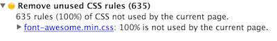

> TL;DR: Use [IcoMoon](https://icomoon.io/app/#/select).

I wanted a plus icon and got a glimpse of hell. Without even a single line of written JavaScript and only to have a plus icon, I loaded almost 100kb sans gzip which contains 2000 lines of CSS and 605 icons. That is 5 times the size of the used MVC framework and roughly 1/3 less than a well known _superheroic_ framework.

## Font Awful

Will I ever use the 603 other icons? I don't know, do you?

It could even be worse as a recent enter~~prise~~bloat project shows: it included Bootstrap with Glyphicons **and** Font Awesome - a total of staggering 250kb from which 6 icons and 20% of the rules were used. In size more than all JavaScript dependencies combined.

Also in the very same project, the icons where used for essential functionality. Sometimes the icon would load late or in some browsers not at all. In this case you couldn't edit a record at all.

Am I saying something crazy here? The actual functionality should never be chained to a font.

## `i` stands for `italic` [\*](https://developer.mozilla.org/en-US/docs/Web/HTML/Element/i)

Whose brilliant idea was it that the letter `Z` should substitute for a Chinese company's icon? Probably the same guy who invented WingDings. And why does everybody use `i` for pseudo-elements?

It makes no sense at all. Icon fonts like Font Awesome are obsolete hacks. Why not use SVG or CSS like it was intended? We have a 94.91% browser support (IE9+) for SVG.

Don't get me wrong, there are cases where it's not feasible or possible to use these technologies and you might need to fall back to icon fonts. But at least use something like [fontello](http://fontello.com/).

To be clear: if you have the option, you should not use icon fonts anymore.

## Works for me

### Plus

In my case `+` is actually on my keyboard, probably on yours too, so I used it. It doesn't look as good but you could style it with limited means.

See the code at <a href="http://codepen.io/akullpp/pen/NNvGrJ/">NNvGrJ</a>

### CSS

Here is a simple CSS solution. I'm not a designer or even know CSS well, so there are certainly better solutions.

If you use a preprocessor you can even minimize the repetitions. Obviously this is specific for my use case and there are many possible scenarios where this wouldn't work.

See the code at <a href="http://codepen.io/akullpp/pen/eZENmQ/">eZENmQ</a>

### SVG

This option seems like overkill for a simple plus icon, but the more complicated your icon gets, the more sense SVG makes. I took the path from [Open Iconic](https://useiconic.com/open/).

See the code at <a href="http://codepen.io/akullpp/pen/xVLwZR/">xVLwZR</a>

