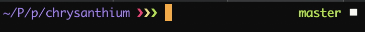
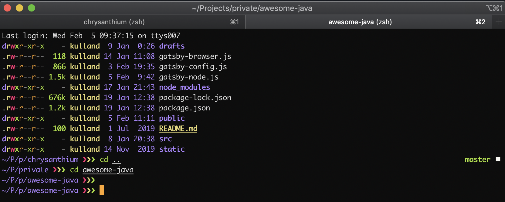
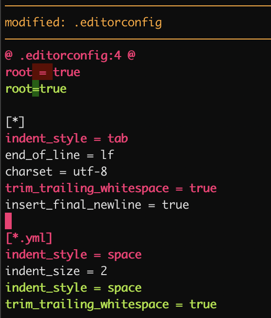
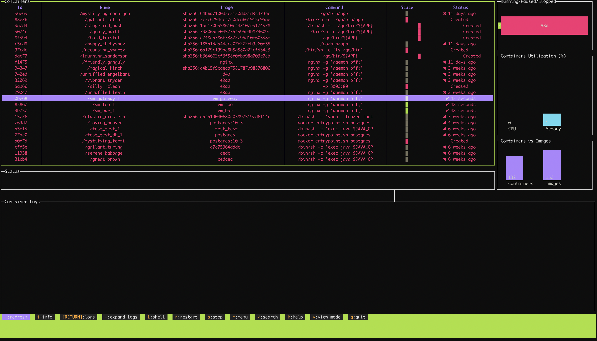
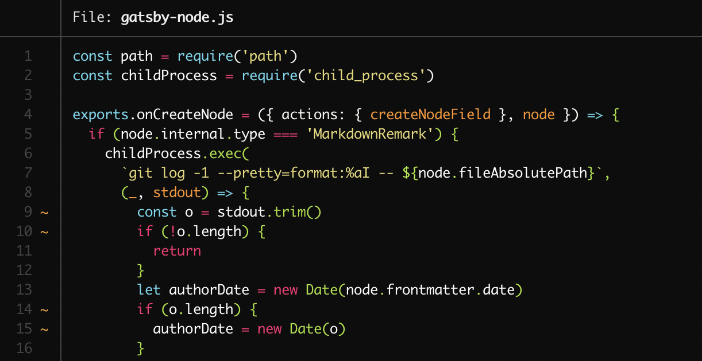
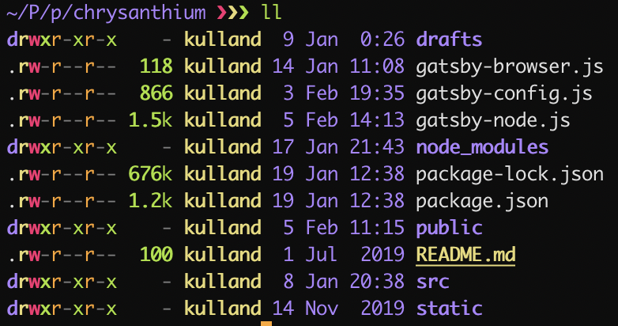
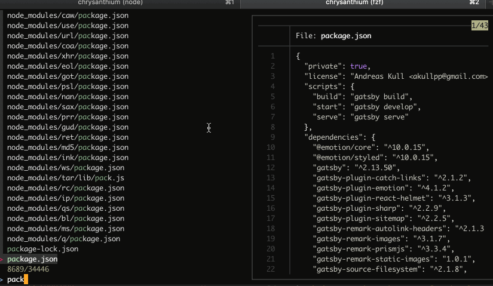
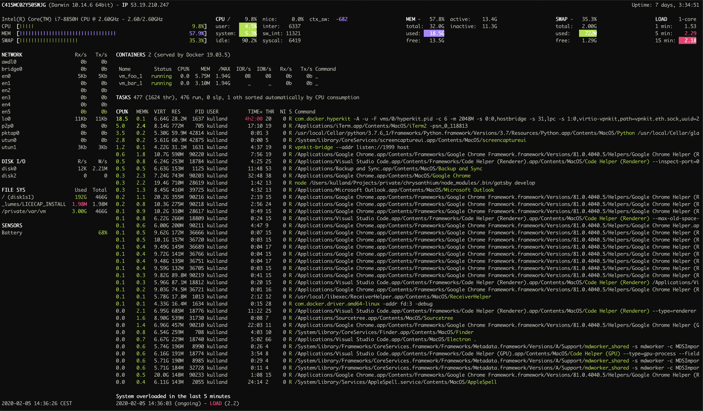
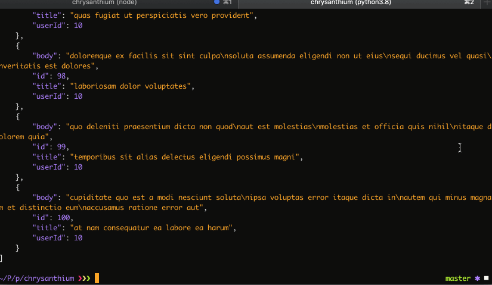
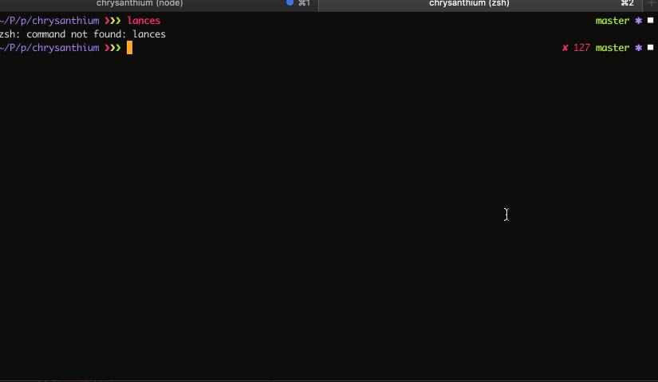

[First Part: Setup for the Decade: Basics](/setup-for-the-decade-basics)

A good shell environment is the key to productivity and goes far beyond of just installing iTerm2 and selecting a nice color scheme. No other shell does it better than [Z shell](https://en.wikipedia.org/wiki/Z_shell) better known as zsh which is fortunately the default now for macOS Catalina. It does a lot of things out of the box like folder and tab completion, typo correction, changing directories without typing `cd`, advanced globbing, multi-session shared history.

While this sounds nice, the best argument for using zsh is it's ecosystem with a myriad of plugins from which I prefer [Prezto](https://github.com/sorin-ionescu/prezto) because it is the fastest configuration framework for zsh while still being user-friendly.

As always the entire code can be found on [GitHub](https://github.com/akullpp/settings).

## Prezto

The installation is easy enough, just ensure you are in zsh:

```shell
zsh

git clone --recursive https://github.com/sorin-ionescu/prezto.git "${ZDOTDIR:-$HOME}/.zprezto"

setopt EXTENDED_GLOB
for rcfile in "${ZDOTDIR:-$HOME}"/.zprezto/runcoms/^README.md(.N); do
  ln -s "$rcfile" "${ZDOTDIR:-$HOME}/.${rcfile:t}"
done

chsh -s /bin/zsh
```

You will then have a new configuration file `.zpreztorc` where you want to configure the theme and available [modules](https://github.com/sorin-ionescu/prezto/tree/master/modules). First of all you can look at the default themes with `prompt -l` and preview them with `promp -p <name>`. I go for `sorin` because it provides exactly the right amount of information for me:



```shell
zstyle ':prezto:module:prompt' theme 'sorin'
```

The only thing I customize is the titles of the window which should show the full path and the tabs which should show the last path segment:

```shell
zstyle ':prezto:module:terminal' auto-title 'yes'
zstyle ':prezto:module:terminal:window-title' format '%s'
zstyle ':prezto:module:terminal:tab-title' format '%c'
```



For plugins I only use a few because most of them are about hotkeys as you can read in [the respective directory](https://github.com/sorin-ionescu/prezto/tree/master/modules):

```shell
zstyle ':prezto:load' pmodule \
  'git' \
  'terminal' \
  'history' \
  'spectrum' \
  'completion' \
  'syntax-highlighting' \
  'history-substring-search' \
  'prompt'
```

The module `git` enables a few hotkeys (which I do not use) but most importantly it enables us to show the status of a git repository in the prompt as you saw before.

`terminal` is required to change the titles of the window and tabs. `history` is self-explanatory.

`spectrum` enables better colors and effects.

`syntax-highlighting` is self-explanatory again.

`history-substring-search` is the reason I fell in love with zsh (although it is originally from fish) which enables you to type any part of any command you have ever written and navigate the history with the arrow keys:


Finally `prompt` is required for customization of the prompt of course.

All of this results in the following `.zpreztorc`:

```shell
zstyle ':prezto:*:*' color 'yes'

zstyle ':prezto:load' pmodule \
  'git' \
  'terminal' \
  'history' \
  'spectrum' \
  'completion' \
  'syntax-highlighting' \
  'history-substring-search' \
  'prompt'

zstyle ':prezto:module:prompt' theme 'sorin'
zstyle ':prezto:module:terminal' auto-title 'yes'
zstyle ':prezto:module:terminal:window-title' format '%s'
zstyle ':prezto:module:terminal:tab-title' format '%c'
```

## Tools provided by npm

First we start with the tools installed by `npm i -g <name>`.

### [diff-so-fancy](https://github.com/so-fancy/diff-so-fancy)

`diff-so-fancy` strives to make your diffs human readable instead of machine readable. This helps improve code quality and helps you spot defects faster.



### [dockly](https://github.com/lirantal/dockly)

`dockly` describes itself as an immersive terminal interface for managing docker containers and services. This is not even half the truth, you can get every available information about the container, immediately jump inside with an interactive shell running and have logging support.



### [npm-check-updates](https://github.com/tjunnone/npm-check-updates)

Did you know that most Node.js modules do not get updated once installed? Especially in Enterprise-context we often pin the versions. I do run `ncu` frequently to assess what I want or need to update, that is the reason why I install it globally:

```shell
~/P/p/chrysanthium ❯❯❯ ncu                                                                                                                                                                                                         master ✱ ◼
Checking /Users/kulland/Projects/private/chrysanthium/package.json
[====================] 26/26 100%

 @emotion/core                   ^10.0.15  →  ^10.0.27
 @emotion/styled                 ^10.0.15  →  ^10.0.27
 gatsby                          ^2.13.50  →  ^2.19.12
 gatsby-plugin-catch-links         ^2.1.2  →   ^2.1.25
 gatsby-plugin-emotion             ^4.1.2  →   ^4.1.22
 gatsby-plugin-react-helmet        ^3.1.3  →   ^3.1.22
 gatsby-plugin-sharp               ^2.2.9  →    ^2.4.5
 gatsby-plugin-sitemap             ^2.2.5  →   ^2.2.27
 gatsby-remark-autolink-headers    ^2.1.3  →   ^2.1.24
 gatsby-remark-images              ^3.1.7  →   ^3.1.44
 gatsby-remark-prismjs             ^3.3.4  →   ^3.3.31
 gatsby-source-filesystem          ^2.1.8  →   ^2.1.48
 gatsby-transformer-remark        ^2.6.10  →   ^2.6.50
 prismjs                          ^1.17.1  →   ^1.19.0
 react-dom                        ^16.8.6  →  ^16.12.0
 eslint                            ^6.1.0  →    ^6.8.0
 eslint-config-airbnb             ^17.1.1  →   ^18.0.1
 eslint-config-prettier            ^6.0.0  →   ^6.10.0
 eslint-plugin-import             ^2.18.2  →   ^2.20.1
 eslint-plugin-react              ^7.14.3  →   ^7.18.3
 prettier                         ^1.18.2  →   ^1.19.1

Run ncu -u to upgrade package.json
```

### [tldr](https://github.com/tldr-pages/tldr)

man pages are pretty awful to read and from another century, e.g. want to know what is running on port 3000? Check the man page for [lsof](https://linux.die.net/man/8/lsof) and maybe in a month or two you have an answer. Now compare this to `tldr lsof`:

```shell
 lsof

  Lists open files and the corresponding processes.
  Note: Root privileges (or sudo) is required to list files opened by others.

  - Find the processes that have a given file open:
    lsof path/to/file

  - Find the process that opened a local internet port:
    lsof -i :port

  - Only output the process ID (PID):
    lsof -t path/to/file

  - List files opened by the given user:
    lsof -u username

  - List files opened by the given command or process:
    lsof -c process_or_command_name

  - List files opened by a specific process, given its PID:
    lsof -p PID

  - List open files in a directory:
    lsof +D path/to/directory

  - Find the process that is listening on a local TCP port:
    lsof -iTCP:port -sTCP:LISTEN
```

QED. Therefore better replace `man` with `tldr`:

```shell
alias man='tldr'
```

## Tools provided by homebrew

Let us continue with the tools installed with `brew install <name>`.

### [autojump](https://github.com/wting/autojump)

Allows to jump to a directory from anywhere by maintaining a database of the most used directories.

- Jump to a directory that contains `<term>`:

```shell
j <term>
```

- Jump to a child directory of current directory that contains `<term>`:

```shell
jc <term>
```

- Open directory that contains `<term>` with the file manager:

```shell
jo <term>
```

A bit of setup is required though:

```shell
[ -f /usr/local/etc/profile.d/autojump.sh ] && . /usr/local/etc/profile.d/autojump.sh
```

### [bat](https://github.com/sharkdp/bat)

A very improved version of `cat` with syntax highlighting and git support.

```shell
alias cat='bat'
```



### [exa](https://github.com/ogham/exa)

Modernized version of `ls` with git support, colors and much more user friendly.

```shell
alias ls='exa'
alias ll='exa -l'
```



### [fzf](https://github.com/junegunn/fzf)

A very fast interactive search tool for files, command history, processes, hostnames, bookmarks, git commits and other things with fuzzy logic. We will connect it with `bat` to enable a preview of the selected file:

```shell
alias f='fzf --preview "bat --color \"always\" {}"'
```

<div class="center">
  
</div>

### [glances](https://github.com/nicolargo/glances)

Improved `htop`.

```shell
alias top='glances'
```



### [httpie](https://httpie.org/)

A command line HTTP client with an intuitive UI, JSON support, syntax highlighting, wget-like downloads and plugins.

<div class="center">
  
</div>

### [jq](https://github.com/stedolan/jq)

A JSON processor for the command line with many possibilities, e.g. extract an attribute of each object in an array:

```shell
http get 'https://api.github.com/users/akullpp/repos' | jq '.[].name'
"akGulp"
"akSkeleton"
"algodat"
"arabro"
"awesome-java"
"awesome-java-lint"
...
```

### [asdf-vm](https://asdf-vm.com/#/)

Recently, I uninstalled `nvm` and `pyenv` and found a general version manager which allows me not only to manage Node.js and Python versions but also Go and Java. It is based on a open-source plugin system and while I found the user experience less than ideal so far, it is a small hinderance compared to the features.

### [thefuck](https://github.com/nvbn/thefuck)

Ever mistyped a command or forgot sudo? The Fuck is an intelligent tool which can guess what you meant.

Requires to be initialized properly:

```shell
eval $(thefuck --alias)
alias fu='fuck'
```

<div class="center">
  
</div>

## ZSH

Here's the full `.zshrc` with all aliases, exports and tools configured:

```shell

##########
# prezto #
##########

if [[ -s "${ZDOTDIR:-$HOME}/.zprezto/init.zsh" ]]; then
	source "${ZDOTDIR:-$HOME}/.zprezto/init.zsh"
fi

########
# asdf #
########

. /usr/local/opt/asdf/asdf.sh
. /usr/local/opt/asdf/etc/bash_completion.d/asdf.bash

############
# autojump #
############

[ -f /usr/local/etc/profile.d/autojump.sh ] && . /usr/local/etc/profile.d/autojump.sh

###########
# thefuck #
###########

eval $(thefuck --alias)

###########
# Aliases #
###########

alias fu='fuck'
alias ls='exa'
alias ll='exa -l'
alias cat='bat'
alias f='fzf --preview "bat --color \"always\" {}"'
alias man='tldr'
alias top='glances'

###############
# Environment #
###############

export PATH=~/go-workspace/bin:~/go/bin:$PATH
export GOPATH=~/go-workspace
export FZF_DEFAULT_OPTS="--bind='ctrl-o:execute(code {})+abort'"

#######
# Run #
#######

ll
```
