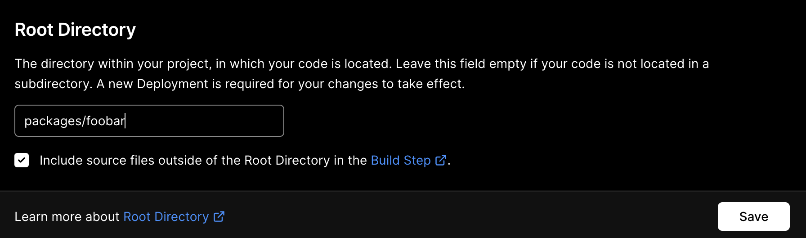

Given a mono-repository with multiple packages, e.g. yarn workspaces:

1. Add a new Vercel project for each package which you want deployed

2. Change the root directory to the package, e.g.:



3. Add following `Ignored Build Step`:


4. Add following script to the root of the package and change permissions via `chmod a+x`, commit and push. It will only build if:
   - it's a preview environment
   - the branch name contains the word `preview`
   - there are changes to the root directory you set above

```bash
#!/usr/bin/env bash
echo VERCEL_ENV=$VERCEL_ENV
echo VERCEL_GIT_COMMIT_REF=$VERCEL_GIT_COMMIT_REF

# Check for preview environment
if [ "$VERCEL_ENV" == "preview" ]; then
  echo "[debug] Is preview environment"
  # Check if branch name contains "preview"
  if [[ "$VERCEL_GIT_COMMIT_REF" == *"preview"* ]]; then
    echo "[debug] Is correct branch"

    # Check for changes to the current directory
    CHANGES=$(git diff HEAD^ HEAD --quiet .;echo $?)
    echo "[debug] Change status: $CHANGES"
    exit $CHANGES
  else
    echo "[debug] Is not preview environment"
  fi
else
  echo "[debug] Is not preview environment"
fi
exit 0
```
