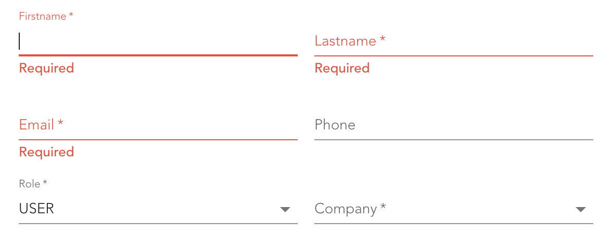
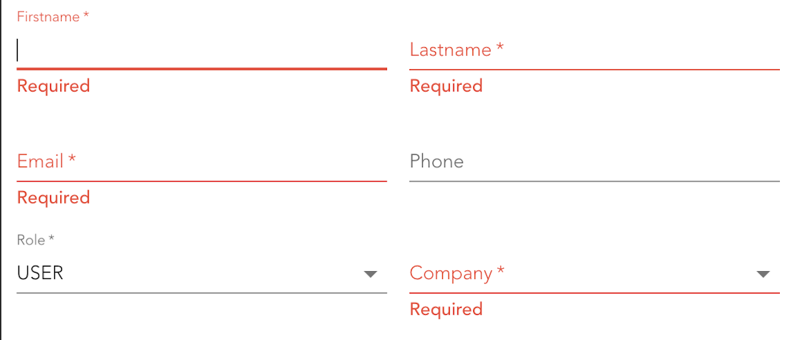

If you do conditional validation with [zod](https://zod.dev/) you'll likely use the `refine` or `superRefine` methods to add logic. Let's say you have a `role` selection and depending on it's value you want to require a `company` field, i.e. if the role is `USER` the company field is required, otherwise not.

Now you define your schema object where `company` might be optional initially and a `superRefine` that checks the role value and adds an issue if it's `USER` and the company is not set. Testing your validation you notice that not all run, in particular the one for company, when you trigger them, e.g. via submit:



Your expectation probably looks like this:



The problem is described [in this GitHub issue](https://github.com/colinhacks/zod/issues/479) in detail. The short version is that the refine methods don't run if something else fails before. The solution is to split up your schema and use `intersection` to re-combine them. Here is an example for above form:

```ts
const schema1 = z
  .object({
    company: z.object({ id: z.any(), label: z.any() }).nullish(),
    role: z.string().trim().min(1),
  })
  .superRefine((values, ctx) => {
    if (values.role === 'USER' && !values.company) {
      ctx.addIssue({
        code: z.ZodIssueCode.custom,
        message: 'Required',
        path: ['company'],
      })
    }
  })
const schema2 = z.object({
  email: z.string().trim().min(1).email(),
  firstName: z.string().trim().min(1),
  lastName: z.string().trim().min(1),
  phoneNumber: z.string().or(z.literal('')).nullish(),
})
const schema = z.intersection(schema1, schema2)
```
