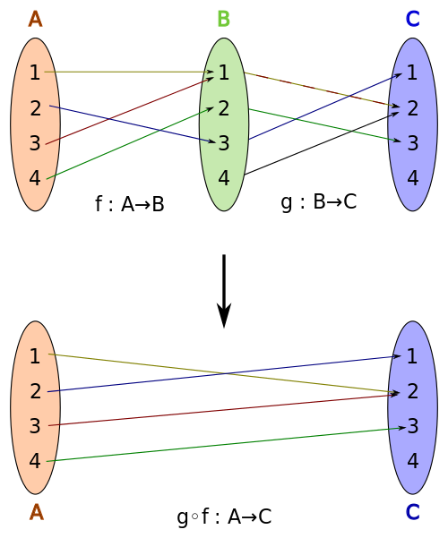

## Composition

**Composition** is the idea of breaking a complex concept down to atoms and then combine them to pipe values through a series of functions.

```js
const compose = (g, h) => x => g(h(x))
```

This compose function takes two functions `g` and `h` and will return an anonymous function which accepts one argument `x`. If we call the returned function with an argument, it will first apply the argument to the last function `x' = h(x)` and the respective return value `x'` as an argument to the first function `x'' = g(x')`.

It's basically chaining functions from inside out where each return value becomes the argument for the next function. So instead of adding cognitive complexity by going step by step, we encapsulate them and go the whole path at once:



Here's a more general version which accepts a number of functions and arguments:

```js
const compose = (fn, ...fns) =>
  fns.length === 0 ? fn : (...args) => fn(compose(...fns)(...args))
```

### Advantages of composition?

**Composition can create a complex data flow consisting of simple atoms**

Let's look at an example of determine the price of a product and assume the following available functions:

```
getProduct, getPrice, applyDiscount, applyTax, applyShipping
```

We can combine them in several ways:

```
getProductPrice = compose(
    getProduct,
    getPrice
)

getProductPriceForRetail = compose(
    getProductPrice,
    applyTax,
    applyShipping
)

getProductPriceForWholesale = compose(
    getProductPrice,
    applyShipping
)

getProductPriceForRetailWithDiscount = compose(
    getProductPriceForRetail,
    applyDiscount
)
```

Because data flows from one pure function to another this creates a program which:

1. is easy to reason about
2. consists of atomic operations which can be easily refactored
3. can be used to build complex systems from simple atoms

## Point-free

In the previous example we have composed a function in **tacit style** since we didn't mention it's arguments even once.

> **Point-free functions** do not identify the arguments on which they operate.

### Advantages of point-free style

**Point-free functions don't need to name their arguments**

One of the hardest things in programming is to find an adequate and relatively persistent name which you don't have to if you never mention the arguments.

**Point-free functions are concise and generic**

It removes unnecessary information of an argument getting passed around which is not your main point of interest. Your interest should lie in the transformations applied which are in sequence easier to understand. Therefore they reduce syntactic noise and strengthen the expressiveness by focusing on the composition itself.

## Links

- [Notes on Functional Programming I: First-class, Pure, Curried Functions](/notes-on-functional-programming-i)
- [Notes on Functional Programming III: Functor, Applicative & Monad](/notes-on-functional-programming-iii)
