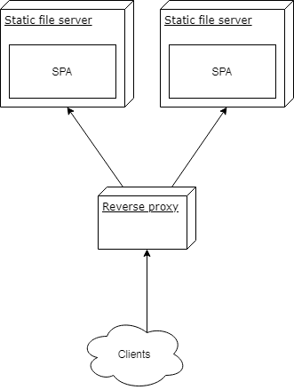

Normally, you would serve one SPA at a specific domain but sometimes the differentiating criteria has to be the path while the host (e.g. `http://www.example.test`) stays the same which means one application should be available at `/foo` and the other at `/bar`. If you do not want to read the whole explanation how to fix this, you can find the code of my solution on [GitHub](https://github.com/akullpp/multiple-react-nginx).

## Workarounds

Unfortunately [create-react-app](https://github.com/facebook/create-react-app) does not support this endeavor yet and there are a dozen issues on their GitHub with new ones created regularly. If you build an CRA project you will find the following epilogue:

```
The project was built assuming it is hosted at 'the server root'.
You can control this with the homepage field in your package.json.
```

Which leads to absolute paths in the `build/index.html`:

```
/static/css/main.c17080f1.css
/static/js/main.37de2feb.js
```

Of course these will not resolve on the server if you serve at a specific path.

The first solution would be abusing the `homepage` property in the `package.json` and making it relative by setting it to `"."` which will result in:

```
./static/css/main.c17080f1.css
./static/js/main.37de2feb.js
```

However the [CRA user guide](https://github.com/facebook/create-react-app/blob/master/packages/react-scripts/template/README.md#deployment) also states that this is only sensible "if you are not using the HTML5 pushState history API or not using client-side routing at all" since URLs can be arbitrary and deeply nested which cannot be known in advance by the router.

Another option would be to use [hash routing](https://github.com/ReactTraining/react-router/blob/master/packages/react-router-dom/docs/api/HashRouter.md) which adds `#` to your URL like in the old times with AngularJS. There is nothing too wrong about that, but I actually want to be able to use the HTML5 API to full extent.

So I will solve this by using absolute paths, however, I do not want to actually abuse the `homepage` field inside the `package.json` because it defies its semantics and syntax.

## Solution

My suggestion is using the `PUBLIC_URL` environment variable which will substitute the `%PUBLIC_URL%` variables in the template `public/index.html` during the build phase. Alternatively, you can also add the variable to `.env` files, one for each environment, and choose the correct one during build-time but this gets ugly fast. However this means you have to rebuild each time you want to host it under a different location. For me, this is more like a theoretical limitation.

Unfortunately, the DevOps part is littered with pitfalls so I decided to write an explicit example for the following containerized components:



with the following relevant folder structure:

```
vm/
  docker-compose.yml
  foo/
    // stuff by create-react-app init
    nginx.conf
    Dockerfile
  bar/
    // stuff by create-react-app init
    nginx.conf
    Dockerfile
  gateway/
    nginx.conf
    Dockerfile
```

## SPA configuration

The two SPAs `foo` and `bar` were created with CRA and `bar` does client-side routing with `react-router-dom` and nested paths. The following paths should be resolved and routed to the correct container without trailing slashes or other invalid fragments:

```
/foo
/foo/
/bar
/bar/
/bar/routeA
/bar/routeB
/bar/routeB/1
/bar/routeB/2
/bar/routeB/2
```

In order to use client-side routing we just need to set the [`basename` attribute](https://reacttraining.com/react-router/web/api/BrowserRouter/basename-string) of your aliased `BrowserRouter`:

```jsx
<Router basename={process.env.PUBLIC_URL}>
```

This will not impact local development since the environment variable will only be set by the CI during build. That is the only modification we need on the client.

Each SPA is build as a Docker container and served by an nginx with the identical `Dockerfile` configurations:

```docker
FROM node as builder

WORKDIR /var/lib/app/
COPY ./package.json ./
COPY ./yarn.lock ./
COPY ./src/ ./src
COPY ./public/ ./public

ARG PUBLIC_URL
RUN yarn --frozen-lockfile --no-cache --production --ignore-optional
RUN yarn run build

FROM nginx

COPY nginx.conf /etc/nginx/nginx.conf
COPY --from=builder /var/lib/app/build/ /var/www/
```

I use a [multi-stage build](https://docs.docker.com/develop/develop-images/multistage-build/) since `node` is only required for the build but you could also serve the files with [serve](https://www.npmjs.com/package/serve) like CRA suggests and keep the image. I am quite verbose with the `COPY` instructions but I like to be explicit here and not add everything in order to keep side-effects to a minimum.

The important part is the build argument `PUBLIC_URL` which will be injected by your CI if it builds your container and pushes it to a registry. I simulate this by the `docker-compose.yml` in the root of the `vm` folder for convenience and demonstration purposes.

The [`nginx.conf`](https://github.com/akullpp/multiple-react-nginx/blob/master/vm/bar/nginx.conf) files for each SPA look pretty minimal too and will just serve the folder under the root, no path specific configuration here.

The interesting pitfall lies in the [`nginx.conf`](https://github.com/akullpp/multiple-react-nginx/blob/master/vm/gateway/nginx.conf) of the `gateway` which is the reverse proxy to our applications. You might be tempted to just do this:

```nginx
location /foo {
  proxy_pass http://vm_foo_1/;
}
```

Which is not only inconvenient but will also lead to requests with double slashes upstream, e.g. `//static/css/main.c17080f1.css`. This will become an issue if you do fancier folder structures. In this scenario there would be no impact since the upstream nginx, which functions as static file server, interprets it correctly. The [documentation](<(http://nginx.org/en/docs/http/ngx_http_core_module.html#location)>) enlightens us about this behavior:

> If a location is defined by a prefix string that ends with the slash character, and requests are processed by one of proxy_pass [...] then the special processing is performed. In response to a request with URI equal to this string, but without the trailing slash, a permanent redirect with the code 301 will be returned to the requested URI with the slash appended.

Luckily they also include a fix which is the duplication of the `location` with a trailing slash:

```nginx
location /bar/ {
  proxy_pass http://vm_bar_1/;
}

location /bar {
  proxy_pass http://vm_bar_1/;
}

location /foo/ {
  proxy_pass http://vm_foo_1/;
}

location /foo {
  proxy_pass http://vm_foo_1/;
}
```

The only thing left is to build and push the individual containers to a registry which is a job for your CI. If you want to do this manually you would do something like:

```shell
docker build --build-arg PUBLIC_URL=<path> .
```

This builds the container of the SPA with the correct `PUBLIC_URL` which will lead to valid requests, e.g. `<PUBLIC_URL>/static/css/main.c17080f1.css` and routing on the server.

However as I explained earlier the [`docker-compose.yml`](https://github.com/akullpp/multiple-react-nginx/blob/master/vm/docker-compose.yml) at the root does this for convenience and demonstration purpose, e.g.

```yaml
services:
  bar:
    build:
      context: ./bar
      args:
        - PUBLIC_URL=/bar
    networks:
      - test
```
