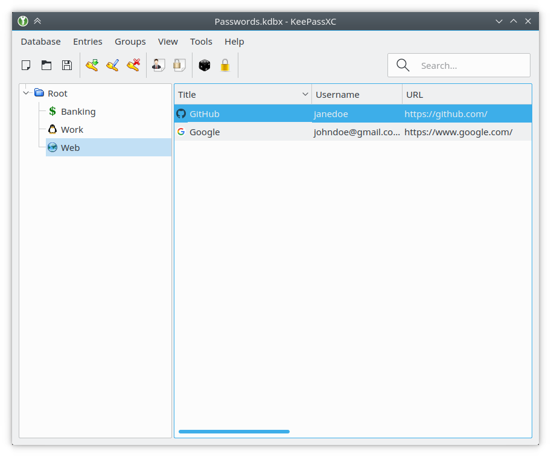

In this article I want to describe the opinionated productivity setup of my work environment which is currently OSX-based and refined over the last decade.

The entire configuration can be found on [GitHub](https://github.com/akullpp/settings).

The next part of the series focuses on the [configuration of the shell](/setup-for-the-decade-shell) which is zsh and prezto.

## Content

- [iTerm2](#iterm2)
- [Google Chrome](#google-chrome)
- [Visual Studio Code](#visual-studio-code)
- [IntelliJ Idea](#intellij-idea)
- [Sourcetree](#sourcetree)
- [Docker](#docker)
- [homebrew](#homebrew)
- [nvm](#nvm)
- [pyenv](#pyenv)
- [insomnia](#insomnia)
- [KeePassXC](#keepassxc)
- [Caffeine](#caffeine)
- [f.lux](#flux)
- [numi](#numi)
- [Rectangle](#rectangle)

## [iTerm2](https://iterm2.com)


First of all you need a good terminal emulator. The best general-purpose one is iTerm2 since it has good color-support, customizability, hotkeys and replay features. In contrast the default Terminal.app has unique OSX features but only gets updates sparsely.

## Google Chrome [>>](https://www.google.com/chrome)

Regardless whether you agree or not, for me this is the most convenient browser and has the best development tools out of the box and good integration with IDE and testing tools. The extensions I run:

- [Clickable Links](https://chrome.google.com/webstore/detail/clickable-links/mgamelhnfokapndfdodnmfiningckjia) makes links in plain text clickable
- [ColorZilla](https://chrome.google.com/webstore/detail/colorzilla/bhlhnicpbhignbdhedgjhgdocnmhomnp) is a color picker
- [Hacker News Collapse](https://chrome.google.com/webstore/detail/hacker-news-collapse/bbkfcamiocfccgmcjngdljolljhifdph) makes comments collapsible
- [I don't care about cookies](https://chrome.google.com/webstore/detail/i-dont-care-about-cookies/fihnjjcciajhdojfnbdddfaoknhalnja) hides cookie notifications
- [Imagus](https://chrome.google.com/webstore/detail/imagus/immpkjjlgappgfkkfieppnmlhakdmaab) enables mouse-over enlargement of media
- [KeePassXC-Browser](https://chrome.google.com/webstore/detail/keepassxc-browser/oboonakemofpalcgghocfoadofidjkkk) automatically inserts credentials
- [Momentum](https://chrome.google.com/webstore/detail/momentum/laookkfknpbbblfpciffpaejjkokdgca) is a nice starting page
- [React Developer Tools](https://chrome.google.com/webstore/detail/react-developer-tools/fmkadmapgofadopljbjfkapdkoienihi) for debugging React
- [Reddit Enhancement Suite](https://chrome.google.com/webstore/detail/reddit-enhancement-suite/kbmfpngjjgdllneeigpgjifpgocmfgmb?hl) provides a better reddit experience
- [Redux DevTools](https://chrome.google.com/webstore/detail/redux-devtools/lmhkpmbekcpmknklioeibfkpmmfibljd) for debugging Redux
- [Save to Pocket](https://chrome.google.com/webstore/detail/save-to-pocket/niloccemoadcdkdjlinkgdfekeahmflj) saves articles for later
- [The Great Suspender](https://chrome.google.com/webstore/detail/the-great-suspender/klbibkeccnjlkjkiokjodocebajanakg) increases performance by suspending unused tabs
- [uBlock Origin](https://chrome.google.com/webstore/detail/ublock-origin/cjpalhdlnbpafiamejdnhcphjbkeiagm) blocks advertisement
- [View Image](https://chrome.google.com/webstore/detail/view-image/jpcmhcelnjdmblfmjabdeclccemkghjk) adds the view image button back to Google's image search

## [Visual Studio Code](https://code.visualstudio.com)


The best IDE out of the box I ever had and I tried everything from Sublime to Code::Blocks to NetBeans to Vim. The only custom hotkeys I have is `ctrl+]` for next and `ctrl+[` for previous editor tab and `ctrl+shift+d` to copy the active line down:

```json
[
    {
        "key": "ctrl+shift+d",
        "command": "editor.action.copyLinesDownAction",
        "when": "editorTextFocus && !editorReadonly"
    },
    {
        "key": "ctrl+]",
        "command": "workbench.action.nextEditor"
    },
    {
        "key": "ctrl+[",
        "command": "workbench.action.previousEditor"
    },
]
```

### VSC Settings

The entire JSON can be found [here](https://github.com/akullpp/settings/blob/master/vsc/settings.json). Following, I will explain the important decisions line by line:

```json
"editor.fontFamily": "Operator Mono Lig",
"editor.fontLigatures": true,
```

[Operator Mono](https://www.typography.com/fonts/operator/styles/operatormono) is the best choice for a monospaced font and I use it everywhere. It is a costly investment of **$199** but I feel it is worth every penny. Furthermore [ligatures](https://github.com/kiliman/operator-mono-lig) are absolutely essential once you get used to it and I could never go back. If you do not have the money to buy the font, you can use [Fira Code](https://github.com/tonsky/FiraCode) which is the next best thing.

```json
"editor.formatOnPaste": true,
"editor.formatOnSave": true,
```

Self-explanatory, I like automatic formatting.

```json
"editor.minimap.enabled": false,
```

You can get some information from the shape of the code but never saw the reason to have the minimap enabled all the time. Also this saves some resources.

```json
"editor.snippetSuggestions": "top",
```

Without this your own snippets will not appear as a suggestion in first position.

```json
"editor.wordWrap": "on",
```

No word wrap on default. Obviously, you want to wrap long lines - if you have them. As I tend to have because I use VSC for literally everything.

```json
"files.associations": {
  "*.js": "javascriptreact"
},
```

I agree with the Airbnb style guide that JSX file endings are bad practice and therefore I want to associate all JS files with React as there are no downsides at all.

```json
"emmet.triggerExpansionOnTab": true,
```

Makes Emmet work automatically on pressing tab.

```json
"explorer.confirmDelete": false,
"explorer.confirmDragAndDrop": false,
```

I do not need to confirm my decisions.

```json
"files.autoSave": "onFocusChange",
```

Manual saving often causes unnecessary mistakes as I know from pair programming. If I did a change and want to view it in the UI, then there is no need for an additional keypress to save my changes.

```json
"files.insertFinalNewline": true,
"files.trimTrailingWhitespace": true,
```

Unbelievable that this is not the default. A missing new line and unnecessary whitespaces can be pretty annoying in diffs.

```json
"explorer.openEditors.visible": 0,
"window.menuBarVisibility": "hidden",
"workbench.activityBar.visible": false,
"workbench.statusBar.visible": false,
```

Decluttering the UI. The open editors section is not useful at all. The menu and activity bar isn't necessary if you know the hotkeys and the status bar often contains too much information.

```json
"workbench.editor.enablePreview": false,
```

The preview feature opens a file and closes it on the loss of focus unless you did a change. I open them for a reason and often need them to stay open.

```json
"workbench.colorTheme": "Monokai Pro",
"workbench.iconTheme": "Monokai Pro Icons",
```

Coming from Sublime this is the only valid choice for a theme.

```json
"workbench.startupEditor": "newUntitledFile",
```

Start with a clean slate and not the same information over and over. I want to use a text editor if I start VSC.

```json
"extensions.ignoreRecommendations": true
```

I do not need or want to be bothered by recommendations.

### VSC Plugins

#### [Auto Close Tag](https://marketplace.visualstudio.com/items?itemName=formulahendry.auto-close-tag)

Automatically adds a closing tag when you type in the closing bracket of the opening tag. After the closing tag is inserted, the cursor is located between the opening and closing tag:

<div class="center">
  
</div>

#### [Auto Rename Tag](https://marketplace.visualstudio.com/items?itemName=formulahendry.auto-rename-tag)

Automatically rename paired HTML/XML tags:

<div class="center">
  
</div>

#### [Babel JavaScript](https://marketplace.visualstudio.com/items?itemName=mgmcdermott.vscode-language-babel)

JavaScript syntax highlighting for ES201x, React JSX, Flow and GraphQL:


#### [Bracket Pair Colorizer 2](https://marketplace.visualstudio.com/items?itemName=CoenraadS.bracket-pair-colorizer-2)

This extension allows matching brackets to be identified with colors. The user can define which tokens to match, and which colors to use:


#### [Code Spell Checker](https://marketplace.visualstudio.com/items?itemName=streetsidesoftware.code-spell-checker)

A basic spell checker that works well with camelCase code to help catch common spelling errors while keeping the number of false positives low. However for prose I prefer another plugin, that is why I remove `plaintext`, `markdown` and `latex` from `cSpell.enabledLanguageIds`:

<div class="center">
  
</div>

#### [Docker](https://marketplace.visualstudio.com/items?itemName=PeterJausovec.vscode-docker)

Provides a myriad of functions to work with Docker and Compose:


#### [EditorConfig for VS Code](https://marketplace.visualstudio.com/items?itemName=editorconfig.editorconfig)

Overrides user/workspace settings with settings defined by [EditorConfig](https://editorconfig.org):


#### [ESLint](https://marketplace.visualstudio.com/items?itemName=dbaeumer.vscode-eslint)

Provides integration with [ESLint](https://eslint.org):


#### [Git History](https://marketplace.visualstudio.com/items?itemName=donjayamanne.githistory)

Allows to search the git log and view previous versions of a file and compare it with branches or commits. GitLens is another popular plugin which I don't use since I either use the CLI or SourceTree:


#### [Go](https://marketplace.visualstudio.com/items?itemName=ms-vscode.Go)

Adds language support for [Go](https://golang.org):


#### [LaTeX Workshop](https://marketplace.visualstudio.com/items?itemName=James-Yu.latex-workshop)

Makes VSC a full-fledged IDE for LaTeX with on-the-fly PDF viewing, IntelliSense, linting and snippets:


#### [markdownlint](https://marketplace.visualstudio.com/items?itemName=DavidAnson.vscode-markdownlint)

Lint and style checking for Markdown since formatting can be inconsistent or even might cause troubles with certain parsers:


#### [Monokai Pro](https://marketplace.visualstudio.com/items?itemName=monokai.theme-monokai-pro-vscode)

This is the color scheme you see in all the images. It also provides an icon set and is designed by the author of the original Monokai colors.

#### [npm](https://marketplace.visualstudio.com/items?itemName=eg2.vscode-npm-script)

Validates the `package.json` and installed modules:


#### [npm Intellisense](https://marketplace.visualstudio.com/items?itemName=christian-kohler.npm-intellisense)

Autocompletes modules in import statements:

<div class="center">
  
</div>

#### [Path Intellisense](https://marketplace.visualstudio.com/items?itemName=christian-kohler.path-intellisense)

Autocompletes path- and filenames:

<div class="center">
  
</div>

#### [Prettier - Code formatter](https://marketplace.visualstudio.com/items?itemName=esbenp.prettier-vscode)

Provides integration with [Prettier](https://prettier.io):

<div class="center">
  
</div>

#### [Settings Sync](https://marketplace.visualstudio.com/items?itemName=shan.code-settings-sync)

Syncs all the VSC settings with a Gist.

#### [Sort lines](https://marketplace.visualstudio.com/items?itemName=Tyriar.sort-lines)

Sort lines of text according to sensitivity, ascending or descending:

<div class="center">
  
</div>

#### [Spell Right](https://marketplace.visualstudio.com/items?itemName=ban.spellright)

Multilingual, offline and lightweight spellchecker:


I use it mainly for prose and not code for which I feel cSpell does a better job:

```json
"spellright.documentTypes": [
  "plaintext",
  "markdown",
  "latex"
]
```

#### [Visual Studio IntelliCode](https://marketplace.visualstudio.com/items?itemName=VisualStudioExptTeam.vscodeintellicode)

Provides AI-assisted development features for Python, TypeScript/JavaScript and Java, with insights based on understanding your code context combined with machine learning:

<div class="center">
  
</div>

## [IntelliJ IDEA](https://www.jetbrains.com/idea)


As in Visual Studio Code, I use the Operator Mono font. For plugins I use:

### IDEA Plugins

#### [Lombok](https://plugins.jetbrains.com/plugin/6317-lombok)

Adds first-class support for [Project Lombok](https://projectlombok.org) which I often use in plain Java projects. Without it IDEA will not process the annotations correctly and therefore the project will not compile at all.

#### [Material Theme UI](https://plugins.jetbrains.com/plugin/8006-material-theme-ui)

Changes the entire look and feel to [Material Design](https://material.io) as you can see in the screenshot above.

#### [PlantUML integration](https://plugins.jetbrains.com/plugin/7017-plantuml-integration)

Provides a diagram tool for PantUML because I like it for my data models:


### IDEA Settings

For code styles (Editor > Code Style > Java) I use the bundled GoogleStyle. The entire settings can be found [here](https://github.com/akullpp/settings/tree/master/idea).

## [Sourcetree](https://www.sourcetreeapp.com)


Git GUI which I use sometimes if I am lazy and, e.g. want to add single lines to separate commits via click.

## [Docker](https://www.docker.com)

Containerization to build and run software everywhere anytime.

## [homebrew](https://brew.sh)

The missing package manager for OSX.

## [nvm](https://github.com/nvm-sh/nvm)

The node version manager manages as the name implies multiple active Node.js versions.

## [pyenv](https://github.com/pyenv/pyenv)

Same as nvm but with Python because version changes in Python are pretty awful.

## [insomnia](https://insomnia.rest/)


Free and open-source REST client for all major platforms which is a modern alternative to Postman.

## [KeePassXC](https://keepassxc.org)



Open-source application that stores passwords offline in a database. Also it supports every major operating system, has browser integration and is not owned by a shady company like LastPass. I suggest synchronizing the database via Google Drive or something similar.

## [Caffeine](http://lightheadsw.com/caffeine)

Caffeine is a tiny program that puts an icon in the right side of your menu bar. Click it to prevent your Mac from automatically going to sleep, dimming the screen or starting screen savers. Click it again to go back. Right-click (or ⌘-click) the icon to show the menu.

## [f.lux](https://justgetflux.com)


Ever notice how people texting at night have that eerie blue glow?

Or wake up ready to write down the Next Great Idea, and get blinded by your computer screen?

During the day, computer screens look good—they're designed to look like the sun. But, at 9PM, 10PM, or 3AM, you probably shouldn't be looking at the sun.

f.lux fixes this: it makes the color of your computer's display adapt to the time of day, warm at night and like sunlight during the day.

It's even possible that you're staying up too late because of your computer. You could use f.lux because it makes you sleep better, or you could just use it just because it makes your computer look better.

f.lux makes your computer screen look like the room you're in, all the time. When the sun sets, it makes your computer look like your indoor lights. In the morning, it makes things look like sunlight again.

Tell f.lux what kind of lighting you have, and where you live. Then forget about it. f.lux will do the rest, automatically.

## [numi](https://numi.app)


An intelligent calculator and converter.

## [Rectangle](https://rectangleapp.com)


Since [Spectacle](https://github.com/eczarny/spectacle#important-note) is not maintained anymore, Rectangle has become the only free open-source solution to resize windows with hotkeys.
