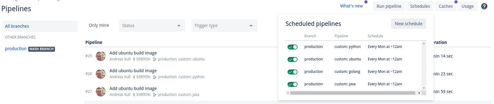

It is good practice to have your own base images which you can modify for security, deployment or application-specific reasons. Obviously, they also need to be handled by your CI/CD and pushed to your container registry.

In this example, we assume a CI/CD with Bitbucket Pipelines and infrastructure on AWS. But the general idea should be applicable to every alternative, which is the following folder structure:

```sh
  golang/
    1.16/
      .latest
      Dockerfile
  python/
    3.8/
      Dockerfile
    3.9/
      .latest
      Dockerfile
```

As you can see each *language* has its own folder and each subfolder is used for a specific *version*.

The idea is to produce an image by concatenating `language:version` and if the `.latest` file is present additionally the image `language:latest`.

The first thing to do, aside from creating a Git repository for this folder, is to set up the following environment variables in your CI/CD. In a Bitbucket repository these are called Repository Variables and can be found in the Settings of the repository:

* `AWS_ACCESS_KEY`
* `AWS_SECRET_ACCESS_KEY`
* `AWS_REGION`
* `AWS_ECR` has the form of `<ACCOUNT>.dkr.ecr.<REGION>.amazonaws.com`

Which will then be used in the following script located at the root under `build.sh`:

```bash
#!/bin/bash

echo "Requires awscli v2"

# Set up AWS
aws configure set aws_access_key_id "${AWS_ACCESS_KEY}"
aws configure set aws_secret_access_key "${AWS_SECRET_ACCESS_KEY}"

# Ensure it is called with a specific language folder
[[ -z "$1" ]] && {
    echo -e "Missing directory"
    exit 1
}

DIR="$1"
TARGET=$(dirname $1)
TAG=$(basename $1)
IMAGE=$AWS_ECR/$TARGET

# Check for latest version file and set flag if true
LATEST=false
if [[ -f "$DIR/.latest" ]]; then
    LATEST=true
fi

echo "---"
echo "REGION=$AWS_REGION"
echo "IMAGE=$IMAGE:$TAG"
echo -e "---\n"

# Login to ECR
aws ecr get-login-password --region $AWS_REGION | docker login --username AWS --password-stdin $AWS_ECR

# Build and push tagged image
docker build -t $IMAGE:$TAG $DIR && docker push $IMAGE:$TAG

# Build and push latest image if .latest exists
if [[ $LATEST = true ]]; then
    docker build -t $IMAGE:latest $DIR && docker push $IMAGE:latest
fi

# Return exit code of the last command
exit $?
```

This requires you to have a build image for your pipeline with AWS and Docker installed, an exercise left to the reader. And do not forget to create the folders on ECR first!

Because it would be tedious to call this script with `./build.sh <language>/<version>` we will hand this over to `bitbucket-pipelines.yml`:

```yml
image: <USE A BUILD IMAGE THAT HAS AWS CLI INSTALLED OR CREATE YOUR OWN>

options:
  max-time: 5

pipelines:
  custom:
    python:
      - step:
          script:
            - ./build.sh python/3.8
            - ./build.sh python/3.9
          services:
            - docker
    golang:
      - step:
          script:
            - ./build.sh golang/1.16
          services:
            - docker
```

We utilize the manually triggered custom pipelines here and call the build script on each `<language>:<version>` path combination.

Because my `Dockerfile` always installs `awscliv2` among other things I push it once to be used in this pipeline, e.g. for `Python@3.8`:

```dockerfile
FROM python:3.8

# Install awscli and kubectl
RUN apt-get update && \
apt-get install --no-install-recommends -y unzip && \
curl -L "https://awscli.amazonaws.com/awscli-exe-linux-x86_64.zip" -o "awscliv2.zip" && \
unzip awscliv2.zip && \
./aws/install && \
curl -L -o /opt/kubectl "https://dl.k8s.io/release/$(curl -L -s https://dl.k8s.io/release/stable.txt)/bin/linux/amd64/kubectl" && \
chmod +x /opt/kubectl && \
ln -s /opt/kubectl /bin/kubectl && \
apt-get remove -y unzip

# Install additional tools
RUN apt-get install --no-install-recommends -y gettext-base jq && \
rm -rf /var/lib/apt/lists/*

# Install python-related stuff
RUN pip install poetry
```

Finally, I set up a weekly schedule for each custom pipeline on Bitbucket:


